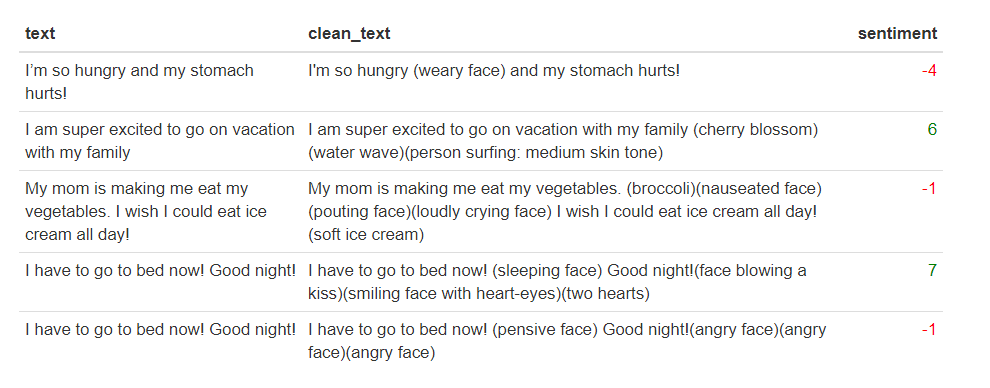

```{r setup, include = FALSE}
knitr::opts_chunk$set(
  collapse = TRUE,
  comment = "#>",
  warning = FALSE, message = FALSE
)
```


Often text data -- especially data from social media websites like Twitter, Facebook or Instagram -- can contain emojis which are small images of facial expressions, places, foods, animals, etc.  Many text mining processes are unable to process these non-alphanumeric characters, and so, in a preprocessing step, they are dropped from text data.  However, removing emojis from text also removes important insight into the meaning of the text data.  For example, "I am going to Advanced R class" followed by a smiley face verse a frowning face takes on different meaning. 

`emoji_to_text` allows users to replace emojis with descriptive phrases as an alternative to dropping these characters from text.

## The Function

```{r eval=FALSE, echo=TRUE}
   emoji_to_text(character_vector, accents = FALSE, delete = FALSE)

```


The function `emoji_to_text` dectects and replaces emojis, as well as accent characters, within text data.  Given a vector of text strings, the function returns a vector of text strings where emoji and/or accent unicodes are replaced with a descriptive phrase i.e. "smiling face with heart-eyes".

The function works by iterating through `Emojis`, an emoji reference data frame.  Using regular expressions, if a byte sequence associated with an emoji is found within the text, the byte sequence is replaced with the corresponding english phrase.

If desired, the option `accents = TRUE` can be specified to allow for characters with accents to be replaced with a corresponding ASCII character. This process works similariy, by iterating through `Accents`, an accent reference data frame.

If `delete = TRUE`, bytes that are not matched to an emoji or an accent are deleted.

## Reference Data Frames

* `Emojis` is a reference data frame containing 3,567 emojis.  The raw data was obtained from [unicode.org](https://unicode.org/emoji/charts/full-emoji-list.html) and contains single unicode emojis as well as more complicated emojis (i.e. containing skin tones). 

* `Accents` is data frame containing 222 accent characters and symbols from [https://en.wikipedia.org/wiki/List_of_Unicode_characters](https://en.wikipedia.org/wiki/List_of_Unicode_characters). If a character is a letter, the user has the option to convert it to its corresponding ASCII character. If a character is a symbol, then it is replaced by an empty string.

## Example: Sentiment Analysis

To demonstrate a potential use for `emoji_to_text`, we will perform sentiment analysis on text after replacing emojis with english phrases.

Suppose we have the following data frame:

```{r}
library(stringr)
library(dplyr)
library(emoji2text)


emoji_text <- data.frame(text = c("I’m so hungry 😩 and my stomach hurts!",
                                  "I am super excited to go on vacation with my family 🌸🌊🏄🏽",
                                  "My mom is making me eat my vegetables. 🥦🤢😡😭 I wish I could eat ice cream all day! 🍦",
                                  "I have to go to bed now! 😴 Good night!😘😍💕",
                                  "I have to go to bed now! 😔 Good night!😠😠😠"),
                         stringsAsFactors = FALSE)
```

Note: 

* The first and second rows contain text that conveys sentiment (i.e. "hurts", "excited"). 

* The third row is a little less clear since there are two sentences that convey opposing sentiments. 

* The fourth and fifth rows contain the same text, however different emojis.  If we were to drop the emojis from these texts, they would both have the same sentiment score.  However, the fourth row suggests that someone is happy and the fifth row suggests that someone is unhappy to go to bed.

When printed, the emojis are displayed as unicode which is not in an interpretable format.  


```{r}
# examine text column
head(emoji_text$text)
```


Before performing our sentiment analysis, let's first convert the emojis to english phrases to extract additional meaning.

```{r}
emoji_text$clean_text <- emoji_to_text(emoji_text$text)
```


To perform sentiment analysis, we will be using the package `syzhet` and the function `get_sentiment`.  For this example, the method used to extract sentiment is the `afinn` method however the `syzhet` package includes multiple different methods for getting the sentiment of a phrase.

```{r}
library(syuzhet)
emoji_text$sentiment <- get_sentiment(emoji_text$clean_text, method = "afinn")
```

Now let's look at our resulting dataframe.
```{r echo=FALSE, out.width="800px"}

```


Notice that by replacing the emojis with their corresponding english phrases, the sentiment scores for the fourth and fifth rows are what we expected.
